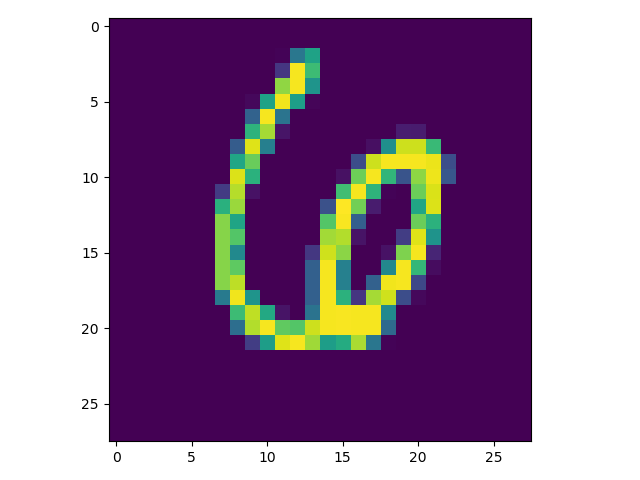
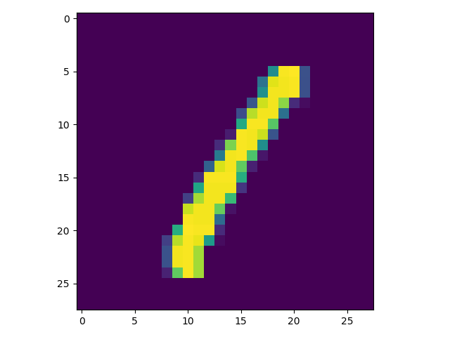
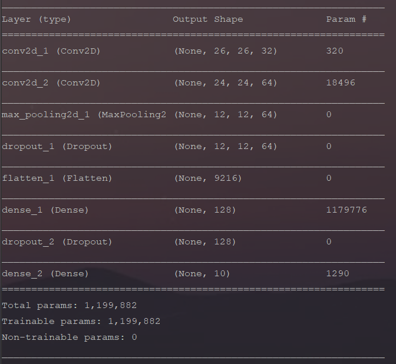

<h1>MNIST NUMBER RECOGNITION WITH CNN</h1>

<h2>Data</h2>

Dataset have handwritten 60000 train, 10000 test images.

Examples;

 
 
 

<h2>Model</h2>

<h2>Result</h2>
Classification accuracy on test images 0,9888 and loss 0,03750.
